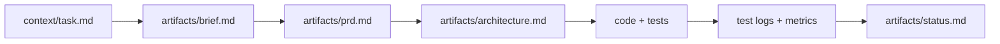

# Repo Overview

## What this repo is
This repo defines a repeatable, testable, agent-based development workflow that turns a ticket or problem statement into validated artifacts, with strict skill boundaries, artifact-first outputs, and verification gates designed to run inside IDE tools like Codex and Antigravity.

## Key user flows / runtime flows
- Create a task entry in `context/task.md` from `templates/task.md`.
- Run the workflow steps in order (analyst → PM → architect → developer → QA → orchestrator).
- Generate artifacts under `artifacts/` (brief, PRD, architecture, status).
- Capture test logs and metrics per specs in `docs/specs/`.
- Stop on NEEDS INPUT or BLOCKED states and resolve before continuing.

## Architecture diagram

## Modules
| Path | Responsibility |
| --- | --- |
| `context/` | Workflow entry point inputs (task.md) |
| `.agent/` | Antigravity workspace config (skills + rules) |
| `.codex/` | Codex team config and Codex skills |
| `docs/` | Specs, checklists, integrations, and project docs |
| `skills/` | Source-of-truth skill definitions |
| `templates/` | Canonical artifact templates |
| `artifacts/` | Generated outputs from workflow runs |
| `examples/` | Sample inputs and end-to-end example artifacts |
| `scripts/` | Helper scripts (sync/validation) |

## How to run locally
- Follow `docs/checklists/run-workflow.md` and use `templates/` to scaffold artifacts.
- Use `scripts/sync-skills.sh` to regenerate platform-specific skills.

## How to test
- Run `scripts/validate-skills.sh` to verify Codex/Antigravity skills are in sync.
- For workflow tests, follow the QA step in `docs/checklists/run-workflow.md` and record logs per `docs/specs/test-logging.md`.

## Deployment notes (if present)
- None found.

## Things that will bite you (gotchas)
- The workflow must stop if any artifact is NEEDS INPUT or BLOCKED.
- Tests cannot be claimed as passed without JUnit XML + raw logs.
- Requirements-to-change mapping is required for diffs/metrics.

## Open questions / missing docs
- No automated workflow runner script is defined (manual checklist only).
- No CI configuration exists for running validation or workflow steps.
