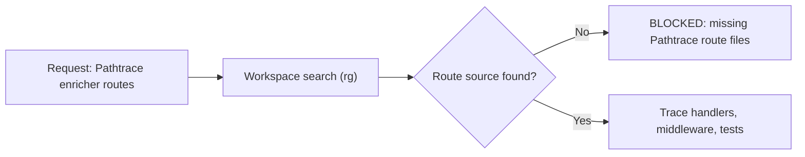

# Repo Overview

## What this repo is
This repository is an agent-workflow scaffold (skills, integration docs, and sync/validation scripts), not an application service repository. For the requested focus area, no `Pathtrace` enricher route implementation or route configuration is present in this workspace, so analysis of runtime route behavior is currently `BLOCKED` on missing source context.

## Key user flows / runtime flows
- Requested flow: inspect Pathtrace enricher routes.
- Discovery flow run in this repo: search for `Pathtrace`, `enricher`, `enrich`, and route definitions via `rg` across workspace files.
- Result: no Pathtrace enricher route code found; only generic "routes/components" wording appears in frontend-regeneration skill docs.
- Fallback flow in this repo: follow workflow/integration docs such as [workflow wiring](docs/integrations/workflow-wiring.md), [Codex integration](docs/integrations/codex.md), and [Anti-Gravity integration](docs/integrations/anti-gravity.md).
- Gate rule: status should be `NEEDS INPUT` or `BLOCKED` when required implementation files are unavailable.

## Architecture diagram

## Modules
| Path | Responsibility |
| --- | --- |
| `README.md` | Repo quickstart and high-level workflow intent. |
| `docs/integrations/workflow-wiring.md` | Canonical workflow stage mapping and gate states. |
| `docs/integrations/codex.md` | Codex setup/execution notes for this workflow repo. |
| `docs/integrations/anti-gravity.md` | Anti-Gravity setup and guardrails for this workflow repo. |
| `skills/regenerate-project-md-frontend.md` | Contains generic mention of "Related routes/components", but no Pathtrace implementation. |
| `.agent/skills/regenerate-project-md-frontend/SKILL.md` | Same high-level route mention in Antigravity skill format. |
| `docs/repo-overview.md` | Current focused overview artifact for this request. |

## How to run locally
- From repo root, verify scope files: `ls -la` and `find . -maxdepth 4 -type f`.
- Confirm Pathtrace absence: `rg -n "(?i)pathtrace|enricher|enrich(er|ment)?|route(s)?" .`.
- Use integration references only for workflow mechanics, not runtime service behavior: [workflow wiring](docs/integrations/workflow-wiring.md), [Codex](docs/integrations/codex.md), [Anti-Gravity](docs/integrations/anti-gravity.md).

## How to test
- Validate skill files in this repo: `./scripts/validate-skills.sh --codex` and/or `./scripts/validate-skills.sh --agent`.
- For Pathtrace enricher route testing, none can be executed here because route source files and route tests are not present.

## Deployment notes (if present)
- None found.

## Things that will bite you (gotchas)
- This workspace does not include app/service source directories (for example, no `src/` tree) for route-level inspection.
- Required docs named in some instructions are missing in this snapshot: `docs/project/structure.md`, `docs/checklists/run-workflow.md`, `docs/specs/skill-contract.md`.
- `docs/integrations/workflow-wiring.md` references additional templates/docs not present, so end-to-end workflow simulation is partial.
- If you proceed without the actual Pathtrace service repo/path, any route explanation would be speculative.

## Open questions / missing docs
- What is the exact filesystem path or repository that contains the Pathtrace enricher routes?
- Which framework is used there (Express/Fastify/Nest/Spring/etc.) so route entry points can be traced accurately?
- Which specific endpoints should be covered (ingest, enrich, health, admin, retry)?
- Are there integration tests or API specs (OpenAPI/Postman) for Pathtrace enricher routes to anchor expected behavior?
