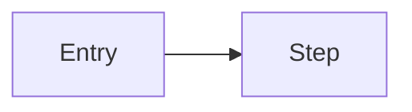

# Repo Overview

## What this repo is
<1 paragraph>

## Key user flows / runtime flows
- 

## Architecture diagram

## Modules
| Path | Responsibility |
| --- | --- |
|  |  |

## How to run locally
- 

## How to test
- 

## Deployment notes (if present)
- None found.

## Things that will bite you (gotchas)
- 

## Open questions / missing docs
- 
